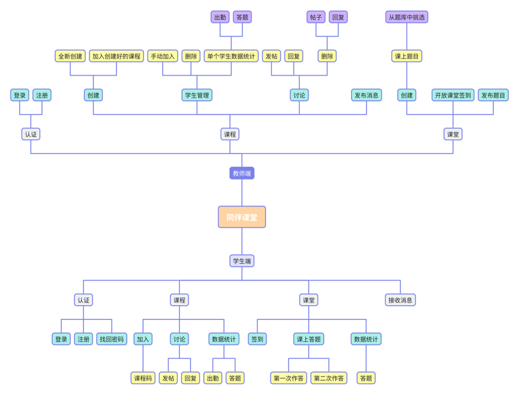
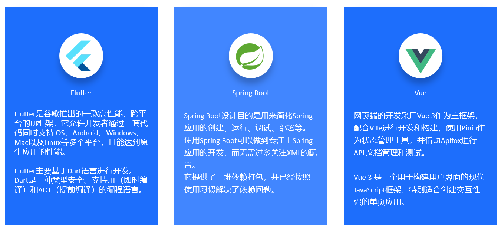
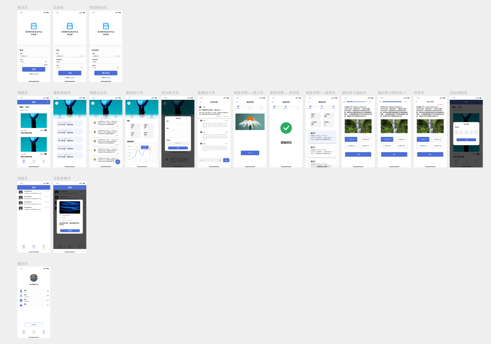

# 同伴课堂

同伴教学法是提高学生学习积极性和参与度的有效途径。然而，实施同伴教学法需要相应的技术支持和平台支撑，以便有效地组织和管理学习活动，收集和分析学习数据，以及提供及时的反馈和评估。

本项目旨在开发一个同伴教学法支撑平台，以满足授课环境中实施同伴教学法的需求。该平台将具备课程课堂管理、学习活动管理、提问与答疑等功能。

经过两个月紧张开发，最终形成了以手机APP为平台的学生端和以网页为平台的教师端，项目名为**同伴课堂**。平台基本具备预期的全部功能，经过测试可以良好运行。

🔗[其他资源](https://github.com/wyt8/bit-cs)

## 概览

功能框架图如下：

技术框架与选型如下：

> [项目说明](./同伴教学法平台.pdf)

## UI原型

使用`MasterGo`绘制了移动端的UI原型，并设置了页面跳转关系。

> 相关链接：
>
> 1. [UI稿](https://mastergo.com/goto/DVT46Yk0?page_id=M&file=140473863480186)
> 2. [界面跳转](https://mastergo.com/goto/DVT6B1lU?page_id=M&layer_id=2:0&proto=1&shared=true)

## 代码

位于`code/`目录下。包含以下子目录：

* `peer_instruction_student`：学生端，使用`Flutter`编写。
* `TeacherWeb`：教师端，使用`Vue3`编写。
* `PI`：后端，使用`SpringBoot`编写。
